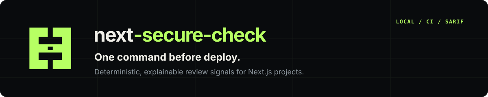
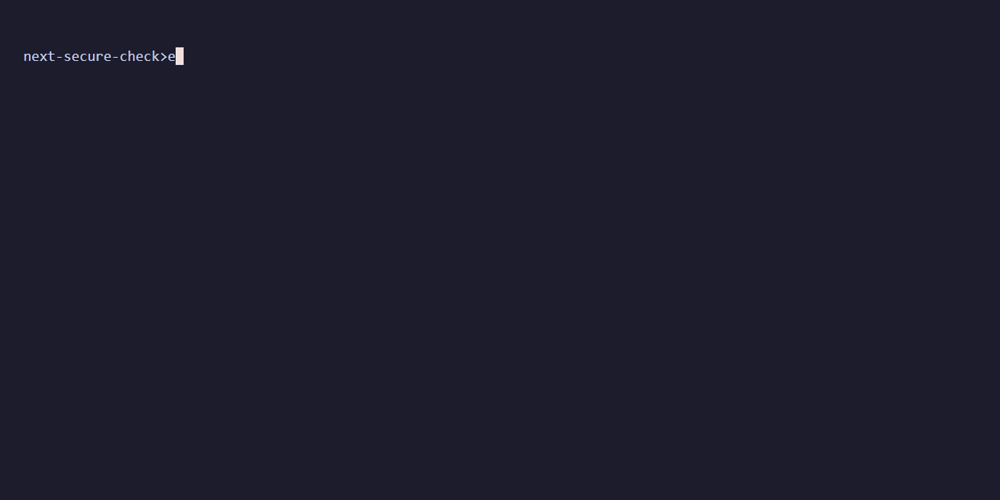

# next-secure-check

<p align="center">
  
</p>

<p align="center">
  <strong>One command before deploy.</strong><br>
  Deterministic, explainable security checks for Next.js projects.
</p>

<p align="center">
  <a href="https://www.npmjs.com/package/next-secure-check"></a>
  <a href="https://github.com/SetraTheXX/next-secure-check/actions/workflows/security-check.yml"></a>
  <a href="./LICENSE"></a>
</p>

> **Stable release:** `v0.6.0` is published on npm and is the `latest` line. The [`v0.6.0` GitHub release](https://github.com/SetraTheXX/next-secure-check/releases/tag/v0.6.0) is the validated CLI release. The reusable [`v1.2.0` Action release](https://github.com/SetraTheXX/next-secure-check/releases/tag/v1.2.0) is available through the floating `@v1` tag.

Run one command from a Next.js project and get a reviewable finding for each detected pattern: rule, severity, confidence, file location, context, evidence path when available, and a recommended fix. The scanner is static and deterministic. It does not execute repository code, install repository dependencies, make network requests, or require AI at runtime.

The checkpoint-gate mark is an original deterministic SVG asset created for this project. A preliminary name and visual collision screen found no direct exact hit in the checked public databases, but that is not legal trademark clearance. The evidence and usage rules are in [`docs/brand/README.md`](./docs/brand/README.md).

<p align="center">
  <a href="#see-it-in-action">See the demo</a> ·
  <a href="#start-here">Start here</a>
</p>

## See it in action

<p align="center">
  
</p>

The demo is generated from the checked-in fixtures with [`docs/demo/next-secure-check.tape`](./docs/demo/next-secure-check.tape). It shows the three `--summary` scans described in [Reproducible fixtures](#reproducible-fixtures). It is a product walkthrough, not proof of exploitability or a universal security score.

## Start here

From the root of the project you want to review:

```bash
npx --yes next-secure-check@0.6.0 scan . --preset app --summary
```

The first run prints a compact score, risk level, finding counts, and representative findings. For the full explanation and recommendation for every finding, remove `--summary`:

```bash
npx --yes next-secure-check@0.6.0 scan . --preset app
```

The CLI requires Node.js `20.9` or newer. Pin the version in CI so a future release does not change a build unexpectedly. Use `@latest` for an intentional local trial of the newest published line.

### Install globally (optional)

```bash
npm install --global next-secure-check
next-secure-check scan . --preset app
```

Check which binary is being used when a global installation is stale:

```bash
next-secure-check --version
npm list --global next-secure-check
```

The versioned `npx` command is the least surprising path for a one-off scan.

## What it checks

The published `v0.6.0` CLI contains 25 built-in rules. The rules cover common secrets, injection, redirect, SSRF, XSS, authentication, validation, upload, header, and Next.js configuration review points.

| Area | Built-in checks |
| --- | --- |
| Secrets | [Committed `.env` files](./docs/rules/env-file-committed.md), [hardcoded secrets](./docs/rules/hardcoded-secret.md), [weak JWT secrets](./docs/rules/weak-jwt-secret.md), [public secret-like names](./docs/rules/next-public-secret.md) |
| Injection | [`eval`](./docs/rules/no-eval.md), [`new Function`](./docs/rules/no-new-function.md), [shell command execution](./docs/rules/command-exec.md), [raw SQL interpolation](./docs/rules/raw-sql-concat.md) |
| Redirects and SSRF | [Unvalidated redirect targets](./docs/rules/unvalidated-redirect-target.md), [unvalidated outbound URLs](./docs/rules/unvalidated-outbound-url.md) |
| XSS | [`dangerouslySetInnerHTML`](./docs/rules/dangerously-set-inner-html.md) |
| Authentication | [Admin route protection](./docs/rules/admin-route-without-auth.md), [login rate limits](./docs/rules/login-without-rate-limit.md), [registration rate limits](./docs/rules/register-without-rate-limit.md), [password hashing](./docs/rules/password-without-hashing-library.md), [Server Action guards](./docs/rules/server-action-without-guards.md), [session-cookie flags](./docs/rules/session-cookie-without-security-flags.md) |
| Validation and uploads | [API input validation](./docs/rules/api-route-without-validation.md), [file type validation](./docs/rules/missing-file-type-validation.md), [file size limits](./docs/rules/missing-file-size-limit.md) |
| Headers and Next.js config | [Security headers](./docs/rules/missing-security-headers.md), [wildcard CORS](./docs/rules/insecure-cors-wildcard.md), [powered-by header](./docs/rules/next-powered-by-header.md), [production browser source maps](./docs/rules/production-browser-source-maps.md), [broad image domains](./docs/rules/next-image-domains.md) |

Read the complete rule documentation in [`docs/rules`](./docs/rules). Each rule documents its intent, examples, confidence, and known boundaries.

## How to read a finding

Every finding is a review signal, not a claim that an exploit is reachable. Use the fields together:

| Field | Meaning |
| --- | --- |
| Rule | Stable identifier and link to the rule explanation |
| Severity | Potential impact if the pattern is relevant (`CRITICAL`, `HIGH`, `MEDIUM`, `LOW`, or `INFO`) |
| Confidence | How strongly the visible syntax matches the rule |
| Location | File and line where the signal was found |
| Context | Route, function, path, or configuration context used by the rule |
| Evidence path | A short recognized source-to-sink path when the rule can prove one within its bounded analysis |
| Recommendation | A concrete review or remediation direction |

The scanner intentionally stops at uncertain boundaries. It does not claim full type-aware taint analysis, cross-file or interprocedural flow, a complete route graph, runtime reachability, or correct behavior of custom wrappers. False positives and false negatives are possible, especially in dynamic or tooling-heavy repositories.

## Terminal, machine, and CI output

The same scan can produce several formats:

```bash
# Detailed terminal report
npx --yes next-secure-check@0.6.0 scan . --preset app

# Compact terminal summary
npx --yes next-secure-check@0.6.0 scan . --preset app --summary

# JSON for scripts
npx --yes next-secure-check@0.6.0 scan . --format json --output next-secure-check.json

# Markdown for an issue or artifact
npx --yes next-secure-check@0.6.0 scan . --format markdown --output next-secure-check.md

# GitHub Step Summary
npx --yes next-secure-check@0.6.0 scan . --format github

# SARIF for GitHub Code Scanning
npx --yes next-secure-check@0.6.0 scan . --format sarif --output next-secure-check.sarif
```

`--summary` is a terminal display option. It cannot be combined with JSON, Markdown, GitHub, or SARIF output. JSON, Markdown, and SARIF redact secret-like evidence; SARIF also carries rule help URIs, CWE mappings where available, deterministic fingerprints, severity metadata, context, and an optional `evidencePath`.

### Failure gates

```bash
# Fail when a HIGH or more severe finding is present
npx --yes next-secure-check@0.6.0 scan . --preset app --fail-on high

# Fail only when the summary risk level is CRITICAL
npx --yes next-secure-check@0.6.0 scan . --preset app --fail-on critical
```

Severity thresholds are `critical`, `high`, `medium`, `low`, and `info`. `critical` is also supported as a risk-level gate; it exits with code `1` only when the scan summary risk is `critical`.

### CLI helpers

```bash
# List all built-in rules
npx --yes next-secure-check@0.6.0 rules

# Explain one rule, including its review boundary
npx --yes next-secure-check@0.6.0 explain xss/dangerously-set-inner-html

# Create starter config and workflow files
npx --yes next-secure-check@0.6.0 init
```

`init` skips existing files by default. Add `--force` only when you intentionally want to overwrite them.

## Presets and configuration

Presets choose a coverage and noise tradeoff. They do not replace manual review.

| Preset | Best for | Behavior |
| --- | --- | --- |
| `default` | General local scans | Broad baseline coverage with standard context tuning |
| `app` | Production application code | Excludes tests, examples, docs, generated output, and workflow/tooling paths |
| `strict` | Aggressive review | Scans broadly with tuning disabled |
| `ci` | Pull requests | Excludes tests and generated output while keeping CI practical |
| `audit` | Broad manual review | Scans broadly with tuning disabled |
| `library` | Component and library repositories | Reduces docs, examples, test, and generated-output noise |
| `monorepo` | Multi-app workspaces | App-focused coverage for `apps/` and `packages/` layouts |

Start with `app` for a deployed Next.js application and use `strict` when you want tooling, examples, and other repository paths included.

The CLI reads `.next-secure-check.json` from the scan target root. Use `--config` for an explicit path.

```json
{
  "preset": "app",
  "excludePaths": ["**/*.test.ts", "**/*.spec.tsx", "examples/**"],
  "categories": ["secrets", "auth", "headers"],
  "failOn": "high",
  "format": "json"
}
```

Supported fields are `excludePaths`, `categories`, `failOn`, `format`, and `preset`. CLI flags override the config file, and the config file overrides defaults:

```text
CLI flag > config file > default
```

For a one-off exclusion, use a comma-separated glob list:

```bash
npx --yes next-secure-check@0.6.0 scan . --preset app \
  --exclude "**/*.test.ts,**/*.spec.tsx,examples/**,.github/**"
```

## GitHub Actions

The scanner runs when the consuming repository adds it to a workflow. It does not monitor repositories on its own.

### Step Summary workflow

```yaml
name: next-secure-check

on:
  pull_request:
  push:
    branches: [main]

permissions:
  contents: read

jobs:
  security-check:
    runs-on: ubuntu-latest
    steps:
      - uses: actions/checkout@v7
      - uses: actions/setup-node@v7
        with:
          node-version: 20
      - name: Run next-secure-check
        shell: bash
        run: |
          set -o pipefail
          npx --yes next-secure-check@0.6.0 scan . --preset app --format github --fail-on high \
            | tee -a "$GITHUB_STEP_SUMMARY"
```

This gate fails the job for a `HIGH` or more severe finding. Change the threshold to `critical` when only a critical risk-level result should block the job.

### Reusable Action

```yaml
- uses: SetraTheXX/next-secure-check@v1
  with:
    path: .
    preset: app
    fail-on: high
    format: github
```

The `@v1` Action currently runs the published `next-secure-check@0.6.0` CLI. Its default `github` format is written to the job Step Summary. For Code Scanning, request SARIF and upload the generated file:

```yaml
- uses: SetraTheXX/next-secure-check@v1
  with:
    path: .
    preset: app
    format: sarif
    output: next-secure-check.sarif

- uses: github/codeql-action/upload-sarif@v3
  with:
    sarif_file: next-secure-check.sarif
```

The Action sets up Node.js 20 and invokes the published CLI. It does not install or execute scripts from the scanned repository.

## Local web demo

[`apps/web`](./apps/web) is a local public-repository scanning demo, not a hosted production service. Its bounded flow is:

```text
Public GitHub URL
  -> URL and metadata validation
  -> tarball download
  -> safe archive extraction
  -> static scan
  -> server-side evidence redaction
  -> cleanup
  -> report UI and JSON/Markdown export
```

The demo:

- accepts public GitHub repositories only;
- never executes repository code, installs dependencies, or runs scripts;
- rejects unsafe archive paths and links;
- applies repository size, request, concurrency, and timeout limits;
- can use `GITHUB_TOKEN` for GitHub API requests;
- supports optional Upstash Redis protection for multi-instance deployments;
- redacts secret-related evidence server-side; and
- can exclude tests and examples for a production-like scan.

Run it locally:

```bash
pnpm install
pnpm build
pnpm -C apps/web dev
```

Its in-memory abuse guard is suitable for local or single-instance use. A public multi-instance deployment needs distributed abuse protection and trusted proxy configuration for IP-based limits.

## Reproducible fixtures

The repository includes deliberately vulnerable and mostly secure Next.js fixtures so the scanner can be checked without cloning another project:

```bash
pnpm build

node packages/cli/dist/index.js scan examples/vulnerable-next-app --preset strict --summary
node packages/cli/dist/index.js scan examples/secure-next-app --preset app --summary
node packages/cli/dist/index.js scan . --preset app --summary
```

Expected summaries for the current `v0.6.0` line:

| Target | Expected result |
| --- | --- |
| `examples/vulnerable-next-app` with `strict` | `0/100`, `critical`, 26 findings (`12 HIGH`, `11 MEDIUM`, `2 LOW`, `1 INFO`) |
| `examples/secure-next-app` with `app` | `99/100`, `excellent`, 1 LOW finding (`headers/missing-security-headers`) |
| repository self-scan with `app` | `100/100`, `excellent`, 0 findings |

These are regression-fixture expectations, not universal accuracy or risk guarantees.

## Security model and limitations

The product is a fast, explainable static review layer. It is not a penetration test, exploit verifier, full security audit, or complete type-aware taint engine.

- Rules combine deterministic patterns, syntax-level AST checks, and path/context signals.
- The bounded source-to-sink checks recognize only documented, visible paths; unknown wrappers, dynamic sinks, reassignment, and cross-file or cross-function flow may be left for manual review.
- UI pages, comments, strings, unused helpers, and unknown local auth or limiter wrappers are not silently treated as protected.
- The scanner makes no network requests while analyzing a local project and does not execute project code.
- The web demo handles public archives only and performs safe extraction before scanning.
- Findings should be triaged with their confidence, context, evidence path, and recommendation.

## Project status and documentation

The stable published line is `v0.6.0`; the older `v0.5.0` line is retained in the validation history for compatibility context. The current roadmap focuses on real-user feedback, confirmed false-positive reduction, and small regression fixtures before another rule slice.

- [Roadmap](./ROADMAP.md)
- [Changelog](./CHANGELOG.md)
- [Rule documentation](./docs/rules)
- [Brand mark, usage, and collision-screen evidence](./docs/brand/README.md)
- [v0.6 quality gate](./docs/validation/phase-24-v06-quality-gate.md)
- [v0.6 request-boundary contract](./docs/decisions/0003-v0.6-request-boundary-contract.md)
- [v0.6 Server Action guard decision](./docs/decisions/0004-v0.6-server-action-guard-signal.md)
- [v0.6 redirect decision](./docs/decisions/0005-v0.6-unvalidated-redirect-signal.md)
- [v0.6 SSRF decision](./docs/decisions/0006-v0.6-ssrf-signal.md)
- [v0.6 cookie and Next.js configuration decision](./docs/decisions/0007-v0.6-config-hardening-signals.md)

## Development

```bash
pnpm install
pnpm build
pnpm typecheck
pnpm lint
pnpm test
pnpm release:gate
```

`pnpm release:gate` runs the frozen `v0.5.0` compatibility checks plus the published `v0.6.0` rule matrix, CLI smoke tests, package contract checks, deterministic-output checks, and disposable fixture benchmarks. It uses local fixtures; public-repository smoke tests remain opt-in and never execute scanned code.

Workspace layout:

```text
apps/web/       local public-repository web demo
packages/core/  scanner orchestration, shared types, score engine
packages/cli/   command-line entrypoint
packages/rules/ built-in rules and AST utilities
packages/reporter terminal, JSON, Markdown, GitHub, and SARIF output
examples/       vulnerable and secure fixtures
docs/rules/     rule documentation
```

The current test baseline is 600 tests across the package and web suites (453 package tests and 147 web tests). Run `pnpm test` locally after changes.

## Contributing and security

- Read [`CONTRIBUTING.md`](./CONTRIBUTING.md) before opening an issue or pull request.
- Use the issue templates for bugs, false positives, false negatives, and feature requests.
- Never include real secrets, tokens, private repository contents, or customer data in public issues.
- See [`SECURITY.md`](./SECURITY.md) for responsible disclosure guidance.

## License

[MIT License](./LICENSE)
